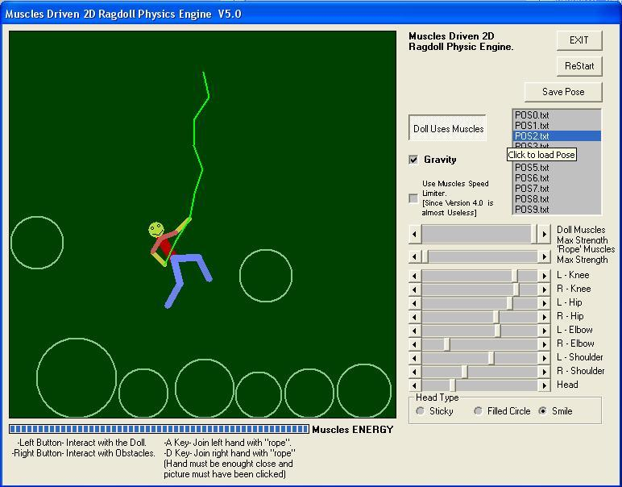



## Muscles Driven 2D Ragdoll Physic Engine \-  V 6\.0  \+\(DollEditor v2\.0\)

### Description

2D Physic Engine based on verlet physics. 

----

Main Elements are 3: Point, Link (2 Points), and Muscle (2 Links)

----

The muscle is defined as two links (limbs) , the angle that should occur between them, and the muscle strength. 

----

You Can manually change Muscles Values with Scrollbars. 

----

Can interact with figure with the mouse. 

----

[ V 3 ] Added Gravity On/Off. Added Save/Load Pose. 

----

[ V 3.1 ] Added Muscles Speed Limiter (It Deny too Fast Muscles movement, so it's good for Stability), and Exit button 

----

[ V 3.2 ] Thickness of Lines bigger than 1 for better vision. Added Collision Response with Circle Shaped Obstacles. Added Obstacles Movement and Obstacle-Obstacle Collision. 

----

[ V 3.3 ] Updated sub ChangeVelocities: Fixed Bug when Bounce on Motionless-Obstacles. Now Can interact with Obstacles too. 

----

[ V 4.0 ] I had a GREAT IDEA!!!: The Strength of Muscles in nature is not Constant. So I thought to apply a Decrement of Strength/energy due to the "Work" done by the Muscles. Nevertheless, this Lost of Strength/Energy is Recovered Costantly, as we do Breathing. This made the physics even more Realistic! . Added Custom Link Color, Thickness , Shape and DrawOrder. Smiling Face. (I Loose myself with VersionNumber) 

----

[ V 5.0 ] Added Joints!!! Can Dynamically Add/Remove Joints! 

----

[ V 5.1 ] Realistic Doll-Obstacles Collision Reaction. Break Points when to much stressed (Buggy). Removed Muscles Speed Limiter. 

----

[ V 5.2 ] Doll Editor! to Customize your creatures. More Joints features. 

----

[ V 5.3 ] Manage Limbs Mass in Muscle movement, manage point Mass in Collision reaction. 

----

[ V 5.4 ] Little bug fixed in point Mass calculation. 

----

[ V 6.0 ] Fixed missing "Option explicits" and Removed Draw Flickering... 

----

 
### More Info
 

             |
---                |---
**Submitted On**   |2009-06-26 11:49:28
**By**             |[reexre](https://github.com/Planet-Source-Code/PSCIndex/blob/master/ByAuthor/reexre.md)
**Level**          |Intermediate
**User Rating**    |5.0 (70 globes from 14 users)
**Compatibility**  |VB 6\.0
**Category**       |[Games](https://github.com/Planet-Source-Code/PSCIndex/blob/master/ByCategory/games__1-38.md)
**World**          |[Visual Basic](https://github.com/Planet-Source-Code/PSCIndex/blob/master/ByWorld/visual-basic.md)
**Archive File**   |[Muscles\_Dr2211729192011\.zip](https://github.com/Planet-Source-Code/reexre-muscles-driven-2d-ragdoll-physic-engine-v-6-0-dolleditor-v2-0__1-72071/archive/master.zip)

